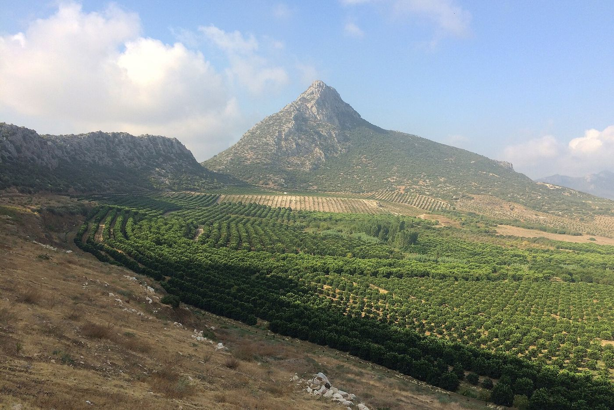

# OrangeGuard AI

**Smart orange orchard monitoring and automation for Nagpur and Vidarbha.**

OrangeGuard AI is a frontend prototype that helps orange farmers keep track of orchard zones, review photos of leaves and fruit, watch live weather, and run day-to-day farm work — all from one dashboard.

> **Status:** demo / prototype. Seed data comes from [`src/data/mockData.js`](src/data/mockData.js) and everything you change is stored in your browser's Local Storage. There is no backend.

---

## Features

| Route | What it does |
| --- | --- |
| `/` **Dashboard** | Hero banner with live zone/tree counts, KPI cards (zones, alerts, tasks, healthy zones), zone health pie chart and a weekly image-scan bar chart. |
| `/analysis` **Image Analysis** | Upload a JPG/PNG/WEBP (max 5 MB) or load one of the four bundled reference samples. MobileNet runs a relevance gate so unrelated photos are rejected, then the page reports category, confidence and safe next steps. |
| `/orchard` **Orchard Zones** | Search, add, edit and delete zones (name, tree count, variety, planting year, status, last inspection, notes). |
| `/weather` **Live Weather** | Current conditions and forecast pulled from the Open-Meteo API with geocoding, cached in Local Storage. |
| `/advisory` **Smart Advisory** | Decision-support suggestions merged from weather, image analysis and inspection history — always with a "not automatically executed" disclaimer. |
| `/alerts` **Alerts** | Prioritised issues with severity, source and recommendation; mark them reviewed or resolved. |
| `/tasks` **Farm Tasks** | Kanban-style board across Pending / In Progress / Completed with priority and due dates. |
| `/reports` **Reports** | Trend charts and CSV export of the demo dataset. |
| `/settings` **Settings** | Configure the demo workspace and reset seeded data. |

## Tech stack

- **React 19** + **Vite 8** (JSX, no TypeScript in the root app)
- **Tailwind CSS v4** via `@tailwindcss/vite` — theme tokens live in [`src/index.css`](src/index.css)
- **Recharts** for the dashboard and reports charts
- **Lucide React** for icons
- **TensorFlow.js + MobileNet** for the image relevance gate
- **Open-Meteo** for live weather (no API key required)
- **React Router v7** for client-side routing
- **oxlint** for linting

> A second, separate Vite + TypeScript + Leaflet app lives in [`file/`](file) with its own `package.json`. It is not part of the root build.

## Getting started

**Prerequisites:** Node.js 20+ and npm.

```bash
# 1. Install dependencies
npm install

# 2. Start the dev server (http://localhost:5173)
npm run dev

# 3. Production build -> dist/
npm run build

# 4. Preview the production build
npm run preview

# 5. Lint
npm run lint
```

## Project structure

```
.
├── index.html               # HTML shell, SEO/social meta tags
├── public/
│   ├── favicon.svg          # OrangeGuard AI icon
│   └── images/              # Bundled photography + CREDITS.json
├── src/
│   ├── App.jsx              # Router, sidebar, per-route header
│   ├── index.css            # Tailwind v4 theme (forest + orange palette)
│   ├── data/mockData.js     # Seed zones, alerts and tasks
│   └── pages/               # One file per route
└── file/                    # Independent TypeScript + Leaflet subproject
```

## Data storage

Zones, alerts and tasks persist in Local Storage under `orange_zones`, `orange_alerts` and `orange_tasks`; the weather response is cached in `orange_weather_cache`. Clear those keys (or use Settings) to return to the seeded demo data.

## How the image analysis works

The upload panel runs **MobileNet** in the browser as a *relevance gate*: it decides whether a photo is a citrus leaf/fruit, an orchard overview, or an unrelated object, and rejects anything outside citrus farming.

It does **not** diagnose disease. There is no trained citrus-disease model behind this UI, so the results panel says so explicitly and gives inspection steps instead of a verdict. The four reference photographs bundled under `public/images/` exist for manual side-by-side comparison only.

> **Do not** use this for real agronomic decisions without physical verification by an expert.

## Image credits

Photography is bundled locally so the app works offline. Sources and licences:

| File | Author | Licence | Source |
| --- | --- | --- | --- |
| `hero-orchard.jpg` | Zeynel Cebeci | CC BY-SA 4.0 | [Citrus Orchard in Adana 01](https://commons.wikimedia.org/wiki/File:Citrus_Orchard_in_Adana_01.jpg) |
| `grove-rows.jpg` | Zeynel Cebeci | CC BY-SA 4.0 | [Citrus Orchard in Adana 05](https://commons.wikimedia.org/wiki/File:Citrus_Orchard_in_Adana_05.jpg) |
| `orange-tree.jpg` | Hans Braxmeier | CC0 | [Orange-tree-1117420](https://commons.wikimedia.org/wiki/File:Orange-tree-1117420.jpg) |
| `sample-healthy.jpg` | Herusutimbul | CC BY-SA 4.0 | [Daun Jeruk](https://commons.wikimedia.org/wiki/File:Daun_Jeruk.jpg) |
| `sample-canker.jpg` | USDAgov | Public domain | [Citrus Canker (APHIS)](https://commons.wikimedia.org/wiki/File:Citrus_Canker_(20151109-APHIS-DB-0052).jpg) |
| `sample-greening.jpg` | USDAgov | Public domain | [Citrus Greening (APHIS)](https://commons.wikimedia.org/wiki/File:Citrus_Greening_(20120120-APHIS-DB-0060).jpg) |
| `sample-deficiency.jpg` | Eiku en exil | CC BY-SA 4.0 | [Chlorose ferrique sur Citrus aurantium](https://commons.wikimedia.org/wiki/File:Chlorose_ferrique_sur_Citrus_aurantium.jpg) |

Machine-readable copy: [`public/images/CREDITS.json`](public/images/CREDITS.json). CC BY-SA images are reproduced under the same licence; the USDA images are public domain.

## Disclaimer

This is an academic/demo prototype. Image analysis results are illustrative, weather data comes from a third-party public API, and no action is performed automatically on any farm equipment.
